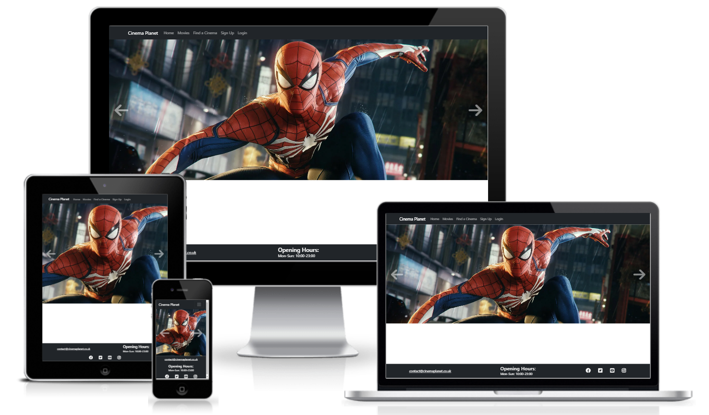

# Cinema Planet - Movie Booking Website

Cinema Planet is the name of the make-believe company in my project. The company is a cinema chain that currently has three cinemas located in the UK. Like other cinemas, it functions by showing the latest, most popular movies. The Cinema Planet website aims to act as a venue for users to view the current movies available at cinema by naviagating through a movie menu. Users can also see information about the particular movies and are able to find the closest cinema to them via the implemented Google Maps API. Users are able to check upcoming showings for each movie and can even make a booking. After making a booking, the user has access to full CRUD functionality, being able to see their active bookings, edit them and delete them. Consequently, the Cinema Planet website gives the user full control over their bookings and acts as an alternative method to the traditional methods of booking cinema tickets, such as by physically visiting the cinema or calling the cinema by telephone. With the almost instant nature of booking online, as well as the easy control over bookings, the website provides the user with a superior user experience and thus represents an advantage for companies in a competitive market. 

The target audience for this project would include, but is not limited to, movie and cinema lovers. These people act as a prime customer for Cinema Planet as they would love the service provided by the cinema and its website. By making an optimal user experience on the website, and coupling it with adequate quality cinemas, it is likely that this demographic would be regular, recurrent customers. In addition, people that don't usually go to the cinema but perhaps occasionally want to visit would be more likely to visit the cinema if the booking system is simple. Thus, the Cinema Planet website appeals to a large audience.

## UX Design and Planning

During the planning stage of this product, I thought about the functionality I want my website to provide to users and thus which pages would be needed to be created to implement the functionality.

### Home Page

For the home page, I aimed to provide users with a simple layout, which would immediately represent itself as a cinema website. Consequently, I included a clear brand logo and movie carousel. Navbar links are also intuitive.

I wanted users to also be able to access their booking details from the homepage for a better user experience. Thus I aimed to include a section below the carousel to display booking details to logged in users.

### Movies Page

For the 'Movies' page, the aim for to simply display all of the movies on at the cinema, in an organised layout. Users are able to click the image or text links to find out more about the particular movie.

When planning the project, I was wondering about the best way to implement the functionality for users to make bookings for a movie. The plan for this page, to allow users to select a date, cinema, time and seat was quite ambitious due to its dynamic nature. I later separated the booking functionality into two pages. Firstly, one where users could select a defined showing (for a particular movie, at a date and specific time, at a specific cinema.) Secondly, a page where users could select the number of seats for their booking. This method proved to be a more realistic, yet still user friendly approach to providing the functionality.

For the 'Find a Cinema' page, the aim was to show users the different locations of 'Cinema Planet' cinemas in an appealing way, using the Google Maps API.

For the 'Sign Up' page, the aim was to provide a simple, attractive form for users to register for an account.

Like the 'Sign Up' page, the aim of the 'Login' page was to provide a simple, attractive form for users to log into their accounts. I later remembered that users would need a 'Sign Out' page, so I implemented one similarly to these two pages.