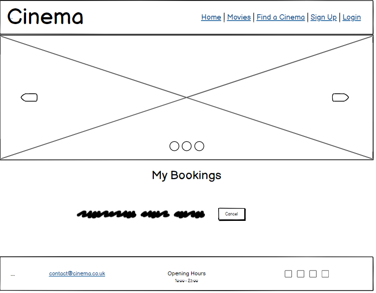
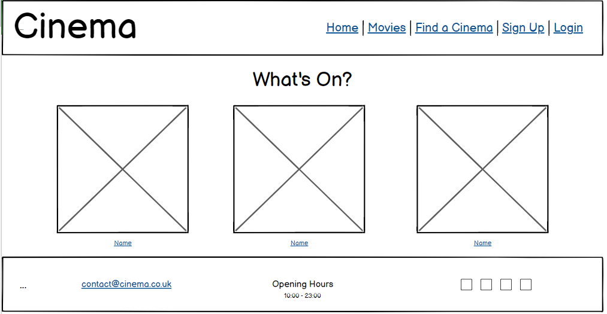
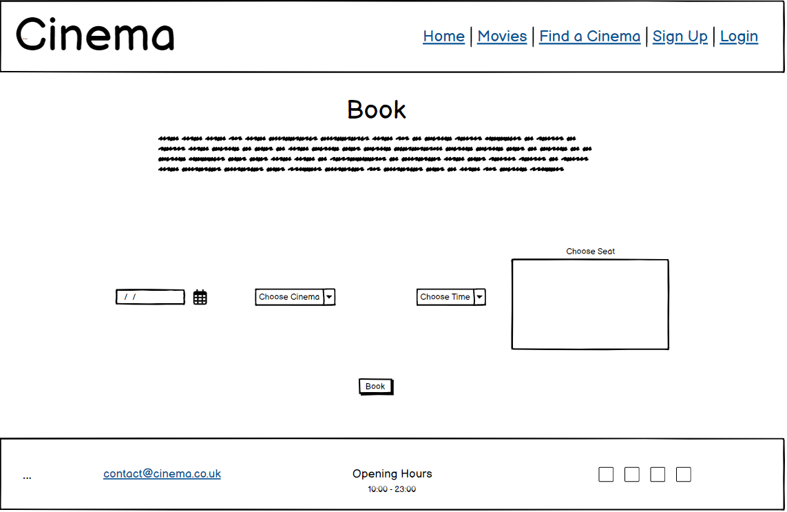
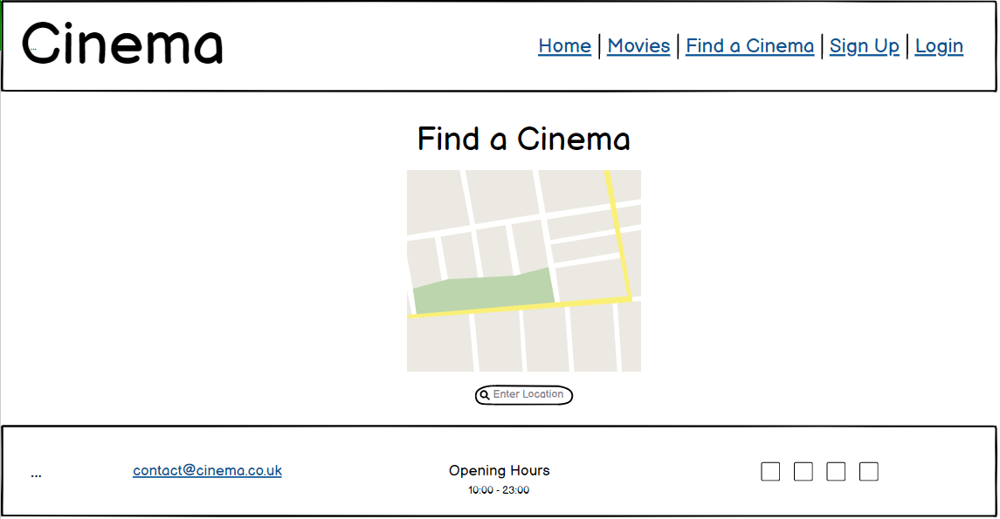
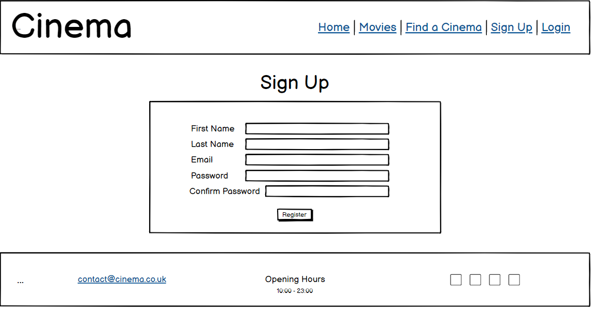
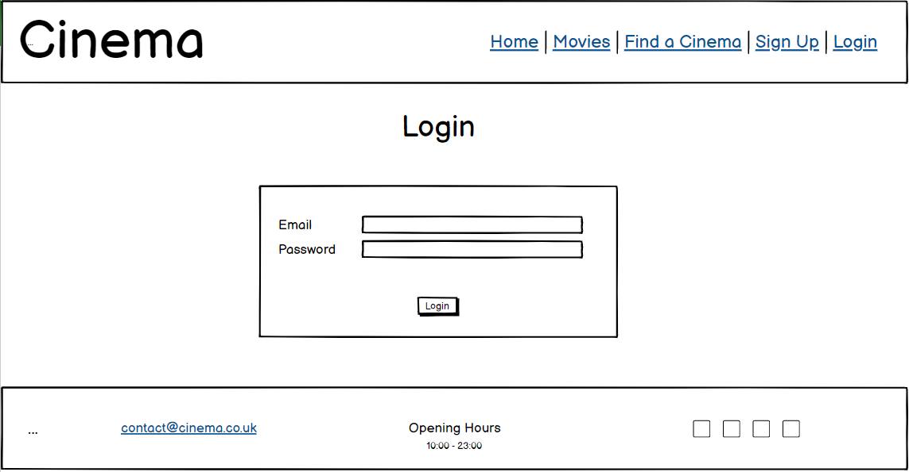
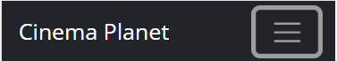
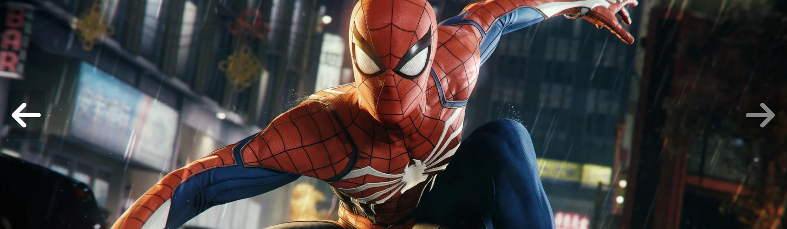
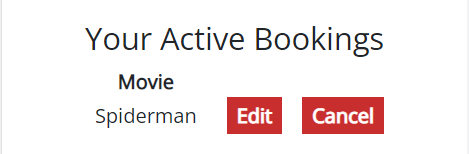
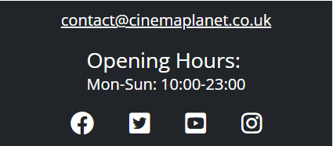

# Cinema Planet - Movie Booking Website

Cinema Planet is the name of the make-believe company in my project. The company is a cinema chain that currently has three cinemas located in the UK. Like other cinemas, it functions by showing the latest, most popular movies. The Cinema Planet website aims to act as a venue for users to view the current movies available at cinema by naviagating through a movie menu. Users can also see information about the particular movies and are able to find the closest cinema to them via the implemented Google Maps API. Users are able to check upcoming showings for each movie and can even make a booking. After making a booking, the user has access to full CRUD functionality, being able to see their active bookings, edit them and delete them. Consequently, the Cinema Planet website gives the user full control over their bookings and acts as an alternative method to the traditional methods of booking cinema tickets, such as by physically visiting the cinema or calling the cinema by telephone. With the almost instant nature of booking online, as well as the easy control over bookings, the website provides the user with a superior user experience and thus represents an advantage for companies in a competitive market. 

The target audience for this project would include, but is not limited to, movie and cinema lovers. These people act as a prime customer for Cinema Planet as they would love the service provided by the cinema and its website. By making an optimal user experience on the website, and coupling it with adequate quality cinemas, it is likely that this demographic would be regular, recurrent customers. In addition, people that don't usually go to the cinema but perhaps occasionally want to visit would be more likely to visit the cinema if the booking system is simple. Thus, the Cinema Planet website appeals to a large audience.

## UX Design and Planning

During the planning stage of this product, I thought about the functionality I want my website to provide to users and thus which pages would be needed to be created to implement the functionality.

### Home Page

For the home page, I aimed to provide users with a simple layout, which would immediately represent itself as a cinema website. Consequently, I included a clear brand logo and movie carousel. Navbar links are also intuitive.

I wanted users to also be able to access their booking details from the homepage for a better user experience. Thus I aimed to include a section below the carousel to display booking details to logged in users.

### Movies Page

For the 'Movies' page, the aim for to simply display all of the movies on at the cinema, in an organised layout. Users are able to click the image or text links to find out more about the particular movie. I later decided to add a review section to the 'Movies' page.

### Booking Page

When planning the project, I was wondering about the best way to implement the functionality for users to make bookings for a movie. The plan for this page, to allow users to select a date, cinema, time and seat was quite ambitious due to its dynamic nature. I later separated the booking functionality into two pages. Firstly, one where users could select a defined showing (for a particular movie, at a date and specific time, at a specific cinema.) Secondly, a page where users could select the number of seats for their booking. This method proved to be a more realistic, yet still user friendly approach to providing the functionality. I also made separate pages for editing and deleting bookings.

### Find a Cinema Page

For the 'Find a Cinema' page, the aim was to show users the different locations of 'Cinema Planet' cinemas in an appealing way, using the Google Maps API.

### Sign Up Page

For the 'Sign Up' page, the aim was to provide a simple, attractive form for users to register for an account.

### Sign In Page

Like the 'Sign Up' page, the aim of the 'Login' page was to provide a simple, attractive form for users to log into their accounts. I later remembered that users would need a 'Sign Out' page, so I implemented one similarly to these two pages.

## Features

### Navigation

- Displays the title of the website / name of the website to the user.
- A clear 'Open Sans' font is used to make the title and links easily visible for the user.
- The dark grey background and white font color create contrast to also aid visibility.
- Allows users to navigate between the different pages on the site.
- Hovering over the navbar links will cause a lightening effect to show that the elements are clickable.
- On smaller devices, a hamburger button appears and when clicked opens a drop-down of the navbar links in a vertical list. This prevents the navbar from taking up unnecessary space when not in use, on smaller devices.
- When users are logged out, they will see links to 'Sign Up' and 'Login'. Logged in users will instead see a 'Logout link'. This dynamic navbar provides users with access to the appropriate functionality for their circumstances, as well as indicates to them their login state.
- Created using bootstrap for a simple, responsive design.

(Large device navbar - logged out)

(Large device navbar - logged in)

  
(Small device navbar - Closed)

  
(Small device navbar - Open)

- Navbar code from https://getbootstrap.com/docs/5.2/components/navbar/

### Home Page Carousel

- This carousel section allows users to cycle thorugh images of the movies currently being shown at the cinema.
- Constributes to forming a modern, attractive landing page.
- Occupies the majority of the page to allow users to clearly see the type of website instantly upon loading the website.
- Regular customers can instantly know if the latest movies are being shown at the cinema by cycling through the carousel.
- Buttons used to allow the user to click and cycle left and right continuously through the loop of movies.

- JavaScript was used to provide the carousel functionality
- Carousel code from https://www.youtube.com/watch?v=9HcxHDS2w1s
- Buttons from FontAwesome

### Home Page Active Bookings

- This section only appears for users that are logged in, that have already made a booking. If a user isn't logged in, or has no active bookings, the section will not be displayed.
- By being located on the home page, users can easily find their booking information, and thus receive a convenient user experience.
- The title clearly shows users what the section is showing.
- When a user makes a new booking, the details of the booking appear as a new row in the table under the heading.
- The table headings are bold and the columns have margin so that the information for each column is clear to the user. Users are able to see their booking: 'Movie', 'Tickets', 'Date' and 'Time'.
- Users are able to have multiple bookings, new bookings append as new rows at the bottom of the table; allowing for users to easily see all of their bookings in a list format.
- Each booking has its own 'Edit' button. Clicking will redirect the user to a new page where they can edit the details of their booking.
- Each booking has its own 'Cancel' button. Clicking will redirect the user to a new page where they can confirm their cancellation.
- 'Edit' and 'Cancel' buttons appear red to stand out easily to the user. A white hover effect makes it obvious to the user that the buttons are clickable.
- Due to the nature of the table being difficult to display on smaller devices, some less important booking details will become hidden to the user to allow the page to be responsive. Bookings can still be identified as sufficient information is kept visible for the uesr and if the user wishes to find all of the details of their booking, they can do so by clicking the 'Edit' button and viewing the details on the 'Edit Booking' page.

(Large device - Active Bookings)

  
(Mobile - Active Bookings)

### Footer

- This section aims to promote users to find out more about the cinema through social media, as well as provide the user with information about the cinema opening times and contact email.
- This section follows the same design theme as the navigation bar for consistency.
- Social links are included as icons from FontAwesome.
- When clicked, the links open in a new tab for a good user experience.
- On larger devices, the three sections are horizontal, but the navbar is also responsive and adopts a vertical layout on smaller devices.
- Code for this section was used from Code Institute's Love Running Project.

(Large device - Footer)

  
(Medium device - Footer)

  
(Large device - Footer)

